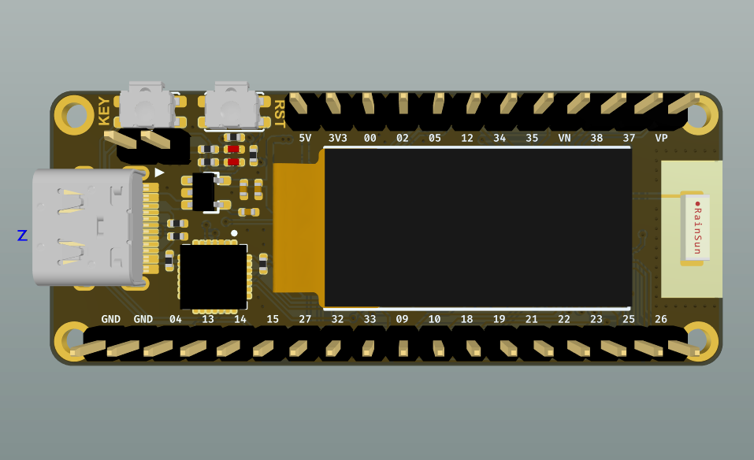
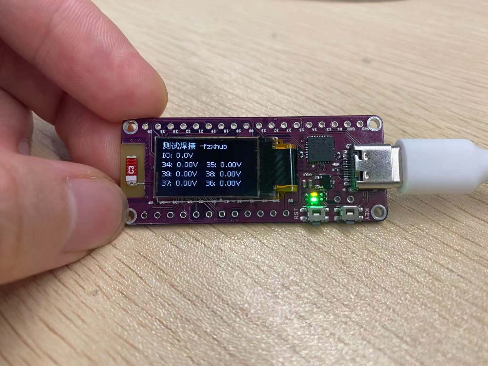

# esp32_pico
这是一个使用esp32-pico-d4设计的迷你开发板

## 背景

这是根据[稚晖君的ESP32-PicoDK](https://github.com/peng-zhihui/ESP32-PicoDK)修改的esp32迷你开发板。

## 修改要点

1. 增加所有IO引出，由于板子非常mini，所以在背面设计表贴焊盘，需要使用这些特殊接口时，使用贴片2.54的插针引出后再使用即可。
2. 将CAN使用的插针改为VCC3.3V和GND管脚。然后将CANL和CANH在背面设计表贴焊盘引出，个人CAN使用较少，使用时贴片2.54的插针引出后再使用即可。
3. 修改两排插针之间间距为700mil，更加规范的间距，可以使用面包板等。

## 图片

## firmware说明

esp32_pico_test固件是用来测试焊接是否OK的，esp32-pico-d4芯片手工焊接有点难度，需要验证所有IO可以使用。

1. 可以烧录固件表示cp2102，串口IO口：UTX、URX可以使用
2. OLED点亮，表示IO21、IO22可以使用
3. 34，35，39(VN)，38，37，36(VP)只能作为输入，接入模拟信号，屏幕上可以显示电压值
4. 其他IO定时反转，使用万用表可以测量，有定时反转表示OK
5. IO16、IO17、IO11、IO6、IO7、IO8特殊功能不加入测试

